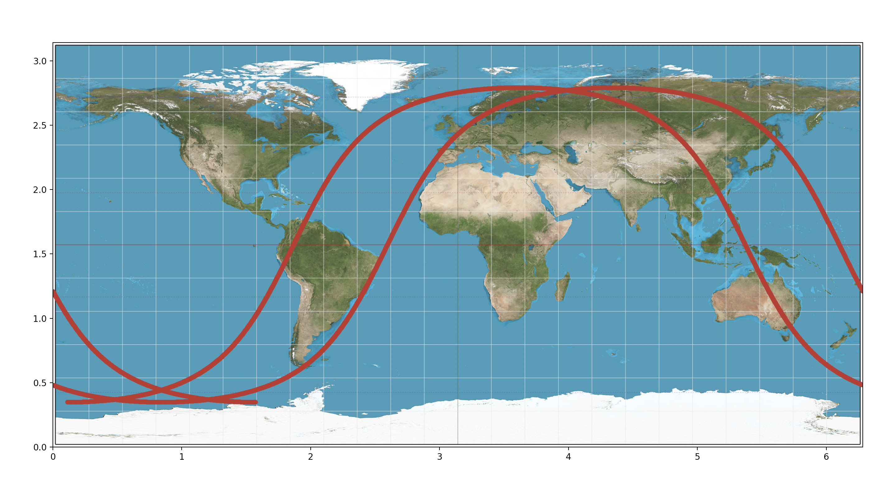

# SatChallenge
Calculating communication satellite orbits for constant ground coverage. 
Sat-Challenge of HackaTUM2021 (Rohde-Schwarz)


# Project Description
This project prvides a working solution and some intermidiate simulation tools to the Sat-Challenge of HackaTUM2021 (prvided by Rohde-Schwarz). 

# Project Structure
In this repo are two visualisation tools:
1. 2D
- GroundTrack.py: script for plotting the GroundTracks of sattelites with adjustable height
- animation.py: script to create animations of the time evolution of a given sattelite distribution and the area that is covered by those sattelites
2. 3D
- The Scenes in the Scenes Folder contain examples on how to use the simulation.
- SatPosBinder.cs feeds the positions of all GameObjects tagged Satellite into the Coverage Compute Shader
- SatellitesOnRing.cs creates Satellite orbits with configurable radius and number of Satellites. The rotation speed is calculated automatically.
- fancyConeShader.shader calculates the effective communication cones from the satellites onto a mesh (the globe) and colors in the doppler shifted regions. The threshold for the acceptable doppler shift is adjustable. It requires a SatPosBinder.cs component on the same object to function.

# Installation
1. 2D
```console
    foo@bar:~$ git clone https://github.com/RiaRosenauer/SatChallenge.git
    foo@bar:~$ cd SatChallenge/2d
    foo@bar:~$ conda create --name HackaTUM21 --file requirements.yml
    foo@bar:~$ conda activate HackaTUM21
    foo@bar:~$ pip install -r requirements.txt   
```

2. 3D 
```
Open the project with Unity 2021.1.27f1 and import any missing dependencies using the package manager.
```

# Usage
1. 2D
- **GroundTrack.py**:
2. 3D
- Open a Sample Scene in the Scenes Folder and Play to test out the simulation.

Starting in line 87 of the file, simply put in the parameters of the satellite track that you would like to see and run the python script. The output
should be something like this:

- **Animation.py**:

In lines 148-159 and 221-226, adjust the animation and sattelite parameters to your needs. Also outcomment and/or uncomment the functions that are highlighted as different modi according to your wishes.
The output is a mp4 file, looking similar too:
